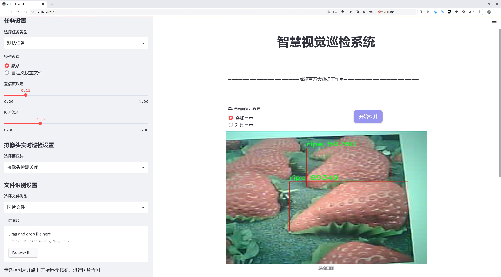
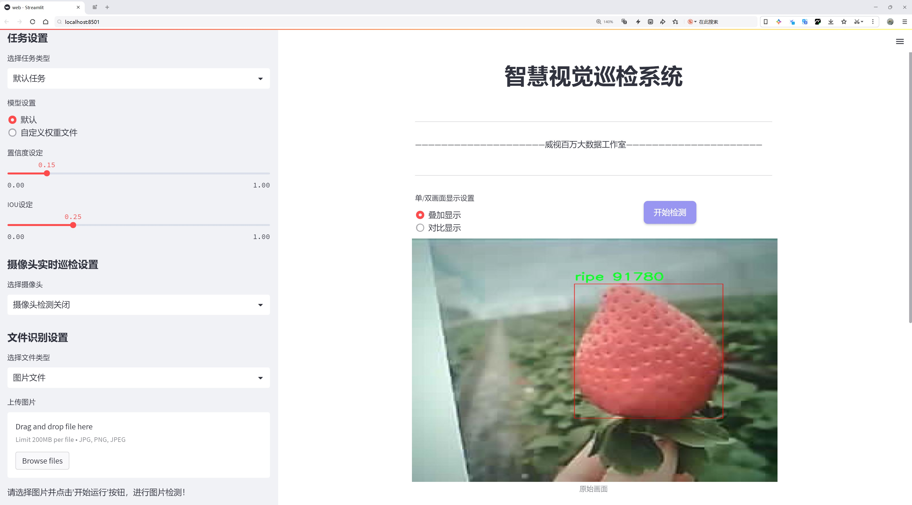
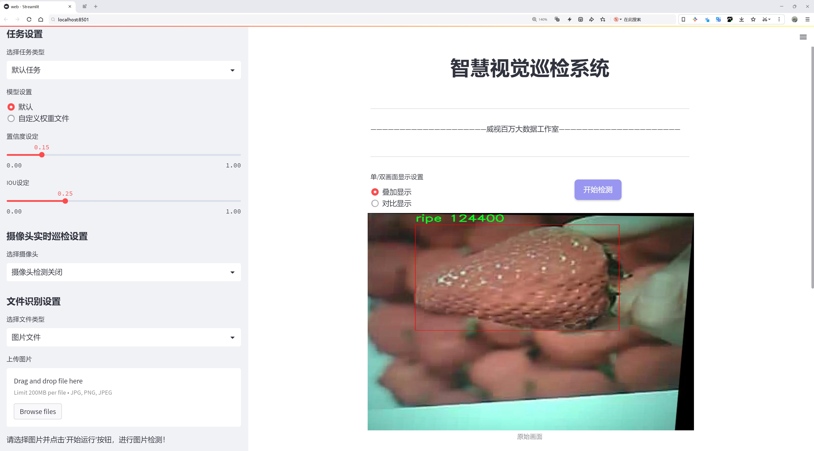
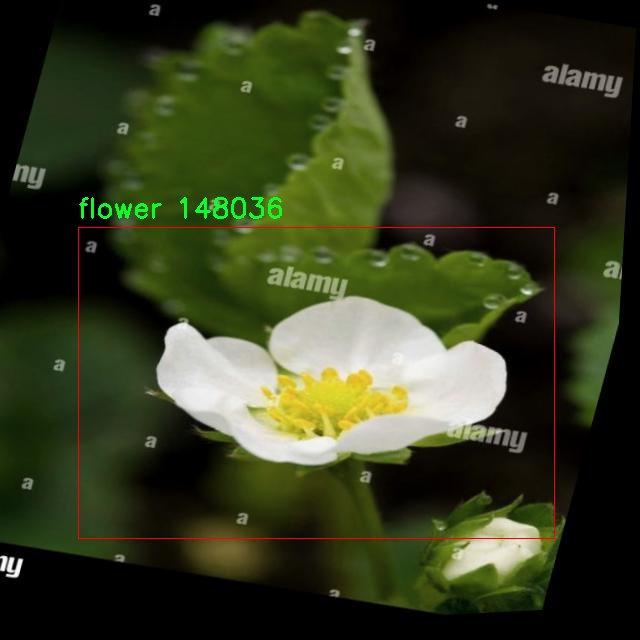
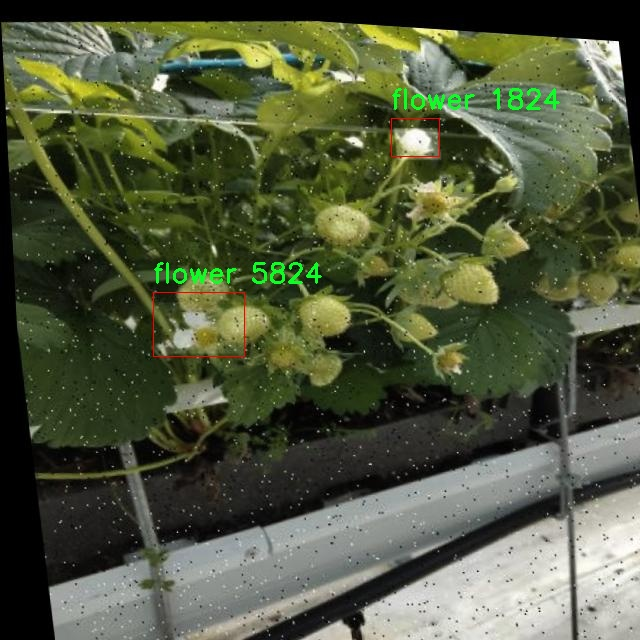
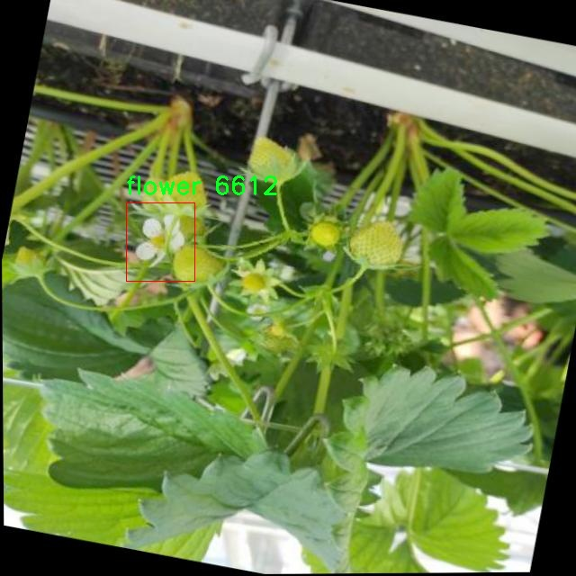
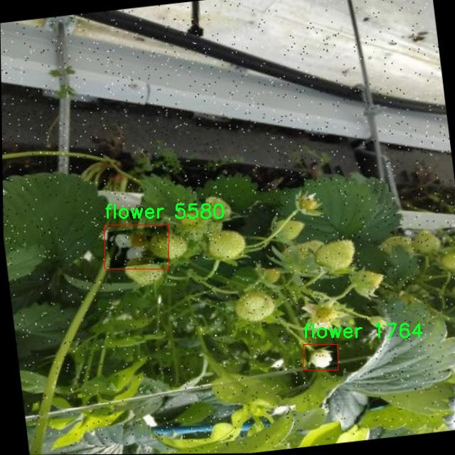
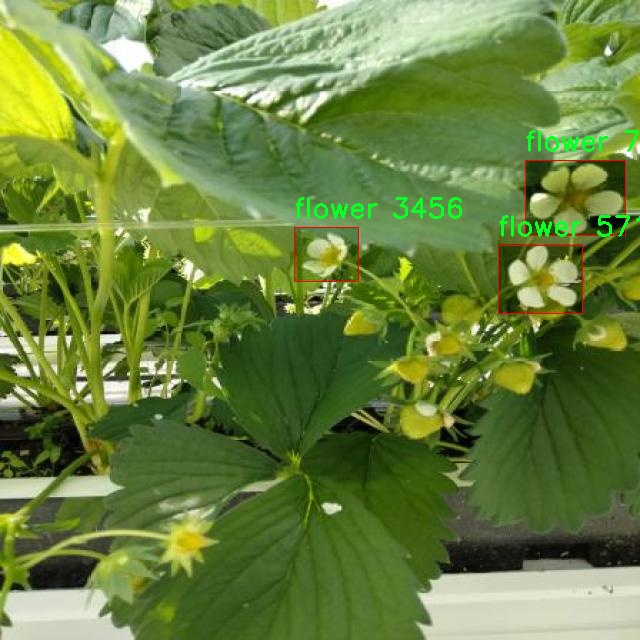

# 草莓成熟度检测检测系统源码分享
 # [一条龙教学YOLOV8标注好的数据集一键训练_70+全套改进创新点发刊_Web前端展示]

### 1.研究背景与意义

项目参考[AAAI Association for the Advancement of Artificial Intelligence](https://gitee.com/qunmasj/projects)

项目来源[AACV Association for the Advancement of Computer Vision](https://github.com/qunshansj/good)

研究背景与意义

随着全球农业生产的不断发展，农作物的质量和产量日益受到重视。草莓作为一种受欢迎的水果，其成熟度的准确检测对于提高农业生产效率、降低损耗以及提升市场竞争力具有重要意义。传统的草莓成熟度检测方法多依赖于人工观察，不仅耗时耗力，而且容易受到主观因素的影响，导致检测结果的不一致性。因此，开发一种高效、准确的草莓成熟度检测系统显得尤为必要。

近年来，计算机视觉和深度学习技术的迅猛发展为农业领域的智能化提供了新的机遇。YOLO（You Only Look Once）系列目标检测算法因其高效性和实时性，已广泛应用于各类物体检测任务中。YOLOv8作为该系列的最新版本，结合了更先进的网络结构和优化算法，能够在保持高精度的同时显著提高检测速度。然而，针对特定农作物的成熟度检测，YOLOv8仍需进行相应的改进和优化，以适应草莓这一特定应用场景的需求。

本研究将基于改进的YOLOv8算法，构建一个草莓成熟度检测系统。该系统将利用“Strawberry-Flower”数据集，该数据集包含4045张图像，涵盖了草莓的三种成熟度类别：花朵、成熟和未成熟。这一丰富的数据集为模型的训练和测试提供了坚实的基础，使得系统能够在不同的光照、角度和背景条件下，准确识别草莓的成熟状态。

通过对YOLOv8的改进，本研究旨在提升草莓成熟度检测的准确性和鲁棒性。具体而言，我们将针对草莓的特征进行数据增强，优化模型的损失函数，并调整网络结构，以提高对不同成熟度草莓的识别能力。此外，系统的实时检测能力将为农民提供及时的决策支持，帮助他们在最佳时机进行采摘，从而最大限度地提高草莓的市场价值。

本研究的意义不仅在于技术层面的创新，更在于其对农业生产方式的深远影响。通过引入智能化的检测系统，能够有效减少人工成本，提高生产效率，降低因过早或过晚采摘导致的经济损失。同时，该系统的成功应用也为其他农作物的成熟度检测提供了借鉴，推动农业智能化的进一步发展。

综上所述，基于改进YOLOv8的草莓成熟度检测系统的研究，不仅具有重要的理论价值，还有助于解决实际生产中的问题，推动农业科技的进步，促进可持续发展。因此，该研究具有重要的学术意义和应用前景。

### 2.图片演示







##### 注意：由于此博客编辑较早，上面“2.图片演示”和“3.视频演示”展示的系统图片或者视频可能为老版本，新版本在老版本的基础上升级如下：（实际效果以升级的新版本为准）

  （1）适配了YOLOV8的“目标检测”模型和“实例分割”模型，通过加载相应的权重（.pt）文件即可自适应加载模型。

  （2）支持“图片识别”、“视频识别”、“摄像头实时识别”三种识别模式。

  （3）支持“图片识别”、“视频识别”、“摄像头实时识别”三种识别结果保存导出，解决手动导出（容易卡顿出现爆内存）存在的问题，识别完自动保存结果并导出到tempDir中。

  （4）支持Web前端系统中的标题、背景图等自定义修改，后面提供修改教程。

  另外本项目提供训练的数据集和训练教程,暂不提供权重文件（best.pt）,需要您按照教程进行训练后实现图片演示和Web前端界面演示的效果。

### 3.视频演示

[3.1 视频演示](https://www.bilibili.com/video/BV1FosNeqE7u/?vd_source=ff015de2d29cbe2a9cdbfa7064407a08)

### 4.数据集信息展示

数据集信息展示

在本研究中，我们使用了一个名为“Strawberry-Flower”的数据集，以改进YOLOv8的草莓成熟度检测系统。该数据集包含4045张高质量的图像，专门用于训练和评估模型在草莓成熟度分类任务中的表现。数据集的设计旨在涵盖草莓生长过程中的不同阶段，确保模型能够准确识别和分类草莓的花朵、成熟果实和未成熟果实三个类别。

在类别方面，数据集细分为三类：花朵（flower）、成熟（ripe）和未成熟（unripe）。每个类别的图像数量经过精心挑选，以确保模型在学习过程中能够获得足够的样本，从而提高其泛化能力。花朵类别的图像展示了草莓植物在开花阶段的特征，主要用于帮助模型理解草莓的生长周期。成熟类别的图像则展示了草莓在最佳采摘时的外观，强调了颜色、形状和质地等关键特征。未成熟类别的图像则帮助模型识别那些尚未达到成熟标准的草莓，确保在实际应用中能够有效区分不同成熟度的果实。

为了增强数据集的多样性和鲁棒性，数据集还包含了经过硬增强处理的大版本图像。这些增强技术可能包括旋转、缩放、翻转、亮度调整等，旨在模拟不同的拍摄条件和环境变化。这种多样化的图像输入能够帮助模型在面对现实世界中的各种情况时，保持较高的识别准确率和稳定性。

数据集的提供者遵循了CC BY 4.0许可证，这意味着用户可以自由使用、修改和分发该数据集，只需在使用时给予适当的署名。这种开放的许可证为研究人员和开发者提供了便利，使得他们能够在此基础上进行更深入的研究和应用开发。

在进行YOLOv8模型的训练时，数据集的构建和选择至关重要。我们将利用该数据集中的图像进行模型的训练和验证，以优化其在草莓成熟度检测任务中的性能。通过精确的标签和丰富的样本，模型将能够学习到不同成熟度草莓的特征，从而在实际应用中实现自动化检测。这一过程不仅有助于提高农业生产效率，还能为农民提供科学的采摘建议，最终推动农业现代化的发展。

总之，“Strawberry-Flower”数据集为草莓成熟度检测系统的研究提供了坚实的基础。其丰富的图像资源和多样的类别设置，将为改进YOLOv8模型的性能奠定重要的基础，推动智能农业的发展进程。通过对该数据集的深入分析和应用，我们期待能够实现更高效的草莓成熟度检测，为农业生产带来新的机遇和挑战。











### 5.全套项目环境部署视频教程（零基础手把手教学）

[5.1 环境部署教程链接（零基础手把手教学）](https://www.ixigua.com/7404473917358506534?logTag=c807d0cbc21c0ef59de5)


[5.2 安装Python虚拟环境创建和依赖库安装视频教程链接（零基础手把手教学）](https://www.ixigua.com/7404474678003106304?logTag=1f1041108cd1f708b01a)

### 6.手把手YOLOV8训练视频教程（零基础小白有手就能学会）

[6.1 环境部署教程链接（零基础手把手教学）](https://www.ixigua.com/7404477157818401292?logTag=d31a2dfd1983c9668658)

### 7.70+种全套YOLOV8创新点代码加载调参视频教程（一键加载写好的改进模型的配置文件）

[7.1 环境部署教程链接（零基础手把手教学）](https://www.ixigua.com/7404478314661806627?logTag=29066f8288e3f4eea3a4)

### 8.70+种全套YOLOV8创新点原理讲解（非科班也可以轻松写刊发刊，V10版本正在科研待更新）

由于篇幅限制，每个创新点的具体原理讲解就不一一展开，具体见下列网址中的创新点对应子项目的技术原理博客网址【Blog】：


[8.1 70+种全套YOLOV8创新点原理讲解链接](https://gitee.com/qunmasj/good)

### 9.系统功能展示（检测对象为举例，实际内容以本项目数据集为准）

图9.1.系统支持检测结果表格显示

  图9.2.系统支持置信度和IOU阈值手动调节

  图9.3.系统支持自定义加载权重文件best.pt(需要你通过步骤5中训练获得)

  图9.4.系统支持摄像头实时识别

  图9.5.系统支持图片识别

  图9.6.系统支持视频识别

  图9.7.系统支持识别结果文件自动保存

  图9.8.系统支持Excel导出检测结果数据


### 10.原始YOLOV8算法原理

原始YOLOv8算法原理

YOLOv8作为目标检测领域的最新进展，承载着YOLO系列模型的创新与发展，展现了更高的检测精度和更快的推理速度。其架构设计旨在有效地处理复杂的视觉任务，涵盖了输入层、主干网络、颈部网络和头部网络等多个关键组件。该模型的核心在于通过深度学习技术对图像进行高效的特征提取与融合，从而实现对目标的准确检测。

在YOLOv8的工作流程中，首先是输入层的图像预处理。输入图像会被缩放至指定的尺寸，以适应模型的输入要求。此过程不仅保证了图像的统一性，还为后续的特征提取打下了基础。接下来，主干网络负责对图像进行特征提取。YOLOv8采用了基于卷积操作的下采样策略，逐层提取图像的深层特征。每个卷积层都配备了批归一化和SiLUR激活函数，这一设计有效地提升了模型的训练效率和收敛速度。值得注意的是，YOLOv8引入了C2f模块，这一模块的设计灵感源自于YOLOv7中的E-ELAN结构，通过跨层分支连接，增强了模型的梯度流动，进而改善了目标检测的效果。

在主干网络的末尾，YOLOv8采用了SPPFl模块，通过三个最大池化层对多尺度特征进行处理。这一模块的设计旨在提升网络的特征抽象能力，使得模型能够更好地捕捉到不同尺度目标的特征信息。特征提取完成后，颈部网络的构建则是为了实现不同尺度特征图的信息融合。YOLOv8的颈部网络结合了特征金字塔网络（FPN）和路径聚合网络（PAN），这两种结构的结合使得语义特征与定位特征能够有效地传递，从而进一步增强了模型对复杂场景的适应能力。

在经过颈部网络的处理后，特征信息被传递至头部网络。YOLOv8的头部网络采用了解耦的检测头结构，这一创新设计将回归和分类的任务分开处理，分别通过两个并行的卷积分支进行计算。这种解耦的方式不仅加速了模型的收敛过程，还提升了检测的精度，使得YOLOv8在面对多种目标时表现得更加出色。

YOLOv8的模型设置也为其性能的提升提供了支持。通过调整depth_factor、width_factor和ratio等参数，用户可以根据具体需求灵活地配置模型的深度和宽度。depth_factor的设置决定了模型的层数，而width_factor则影响到每层的通道数。这种灵活性使得YOLOv8能够在不同的硬件环境下实现最佳性能，满足多样化的应用需求。

在YOLOv8的设计中，除了注重模型的性能外，还特别考虑了用户的使用体验。YOLOv8原生支持自定义数据集，使得用户能够根据自身的需求进行模型的训练和调整。这一特性不仅提升了模型的适用性，也为用户提供了更大的自由度，使得YOLOv8能够广泛应用于各类实际场景中。

综上所述，YOLOv8作为目标检测领域的前沿模型，其原始算法原理通过精心设计的网络结构和灵活的参数设置，展现了卓越的性能。无论是在检测精度、推理速度，还是在用户友好性方面，YOLOv8都实现了显著的突破。这些优势使得YOLOv8成为当前业界最流行和成功的目标检测算法之一，为计算机视觉的进一步发展奠定了坚实的基础。通过不断的优化与创新，YOLOv8不仅在技术上引领了潮流，也为未来的研究和应用提供了新的思路和方向。


### 11.项目核心源码讲解（再也不用担心看不懂代码逻辑）

#### 11.1 ultralytics\models\yolo\__init__.py

以下是对给定代码的核心部分进行分析和详细注释的结果：

```python
# 引入Ultralytics YOLO库，使用AGPL-3.0许可证

# 从ultralytics.models.yolo模块中导入五种不同的功能：分类(classify)、检测(detect)、方向边界框(obb)、姿态估计(pose)和分割(segment)
from ultralytics.models.yolo import classify, detect, obb, pose, segment

# 从当前模块中导入YOLO类
from .model import YOLO

# 定义模块的公开接口，包含五种功能和YOLO类
__all__ = "classify", "segment", "detect", "pose", "obb", "YOLO"
```

### 代码分析与注释：

1. **引入库**：
   - `from ultralytics.models.yolo import classify, detect, obb, pose, segment`：这一行代码从`ultralytics.models.yolo`模块中导入了五个功能模块，分别用于图像分类、目标检测、方向边界框处理、姿态估计和图像分割。这些功能是YOLO（You Only Look Once）模型的核心应用，适用于计算机视觉任务。

2. **导入YOLO类**：
   - `from .model import YOLO`：这一行代码从当前包的`model`模块中导入了`YOLO`类。`YOLO`类通常是实现YOLO算法的主要类，包含了模型的初始化、训练和推理等功能。

3. **定义公开接口**：
   - `__all__ = "classify", "segment", "detect", "pose", "obb", "YOLO"`：这一行代码定义了模块的公开接口，指定了在使用`from module import *`时可以导入的名称。这样做可以控制模块的可见性，确保只暴露必要的功能和类。

### 总结：
这段代码主要是设置了YOLO模型的核心功能模块的导入，并定义了模块的公开接口。通过这些功能，用户可以方便地使用YOLO进行各种计算机视觉任务。

这个文件是Ultralytics YOLO项目中的一个初始化文件，位于`ultralytics/models/yolo`目录下。文件的主要功能是导入YOLO模型相关的模块，并定义了该模块的公共接口。

首先，文件顶部的注释表明这是Ultralytics YOLO项目，并且使用的是AGPL-3.0许可证。这种许可证允许用户自由使用、修改和分发软件，但要求在分发时保持相同的许可证。

接下来，文件通过`from`语句导入了几个子模块，这些子模块分别是`classify`、`detect`、`obb`、`pose`和`segment`。这些模块对应于YOLO模型的不同功能，比如分类、检测、边界框（obb）、姿态估计和分割等。这表明该YOLO实现不仅支持目标检测，还扩展到了其他计算机视觉任务。

最后，`__all__`变量被定义为一个元组，包含了可以被外部导入的模块名称。这是一个约定，用于控制`from module import *`语句的行为，确保只有列在`__all__`中的名称会被导入。这种做法有助于隐藏模块内部的实现细节，只暴露出必要的接口，提升了代码的封装性和可维护性。

综上所述，这个文件主要是作为YOLO模型的入口，整合了多个功能模块，并通过`__all__`定义了可供外部使用的接口。

#### 11.2 ultralytics\utils\tal.py

以下是经过简化和注释的核心代码部分，主要集中在 `TaskAlignedAssigner` 类及其关键方法上：

```python
import torch
import torch.nn as nn

class TaskAlignedAssigner(nn.Module):
    """
    任务对齐分配器，用于目标检测。
    该类根据任务对齐度量将真实目标（gt）分配给锚点，结合了分类和定位信息。
    """

    def __init__(self, topk=13, num_classes=80, alpha=1.0, beta=6.0, eps=1e-9):
        """初始化任务对齐分配器对象，设置超参数。"""
        super().__init__()
        self.topk = topk  # 考虑的候选数量
        self.num_classes = num_classes  # 目标类别数量
        self.bg_idx = num_classes  # 背景类别索引
        self.alpha = alpha  # 分类组件的参数
        self.beta = beta  # 定位组件的参数
        self.eps = eps  # 防止除以零的小值

    @torch.no_grad()
    def forward(self, pd_scores, pd_bboxes, anc_points, gt_labels, gt_bboxes, mask_gt):
        """
        计算任务对齐分配。
        参数：
            pd_scores: 预测的得分，形状为 (bs, num_total_anchors, num_classes)
            pd_bboxes: 预测的边界框，形状为 (bs, num_total_anchors, 4)
            anc_points: 锚点坐标，形状为 (num_total_anchors, 2)
            gt_labels: 真实目标标签，形状为 (bs, n_max_boxes, 1)
            gt_bboxes: 真实目标边界框，形状为 (bs, n_max_boxes, 4)
            mask_gt: 真实目标掩码，形状为 (bs, n_max_boxes, 1)

        返回：
            target_labels: 目标标签，形状为 (bs, num_total_anchors)
            target_bboxes: 目标边界框，形状为 (bs, num_total_anchors, 4)
            target_scores: 目标得分，形状为 (bs, num_total_anchors, num_classes)
            fg_mask: 前景掩码，形状为 (bs, num_total_anchors)
            target_gt_idx: 目标索引，形状为 (bs, num_total_anchors)
        """
        self.bs = pd_scores.size(0)  # 批量大小
        self.n_max_boxes = gt_bboxes.size(1)  # 最大目标数量

        # 如果没有真实目标，返回背景标签和零值
        if self.n_max_boxes == 0:
            device = gt_bboxes.device
            return (
                torch.full_like(pd_scores[..., 0], self.bg_idx).to(device),
                torch.zeros_like(pd_bboxes).to(device),
                torch.zeros_like(pd_scores).to(device),
                torch.zeros_like(pd_scores[..., 0]).to(device),
                torch.zeros_like(pd_scores[..., 0]).to(device),
            )

        # 获取正样本掩码、对齐度量和重叠度
        mask_pos, align_metric, overlaps = self.get_pos_mask(
            pd_scores, pd_bboxes, gt_labels, gt_bboxes, anc_points, mask_gt
        )

        # 选择重叠度最高的目标
        target_gt_idx, fg_mask, mask_pos = self.select_highest_overlaps(mask_pos, overlaps, self.n_max_boxes)

        # 获取目标标签、边界框和得分
        target_labels, target_bboxes, target_scores = self.get_targets(gt_labels, gt_bboxes, target_gt_idx, fg_mask)

        # 归一化对齐度量
        align_metric *= mask_pos
        pos_align_metrics = align_metric.amax(dim=-1, keepdim=True)  # 最大对齐度量
        pos_overlaps = (overlaps * mask_pos).amax(dim=-1, keepdim=True)  # 最大重叠度
        norm_align_metric = (align_metric * pos_overlaps / (pos_align_metrics + self.eps)).amax(-2).unsqueeze(-1)
        target_scores = target_scores * norm_align_metric  # 更新目标得分

        return target_labels, target_bboxes, target_scores, fg_mask.bool(), target_gt_idx

    def get_pos_mask(self, pd_scores, pd_bboxes, gt_labels, gt_bboxes, anc_points, mask_gt):
        """获取正样本掩码。"""
        mask_in_gts = self.select_candidates_in_gts(anc_points, gt_bboxes)  # 选择在真实目标内的锚点
        align_metric, overlaps = self.get_box_metrics(pd_scores, pd_bboxes, gt_labels, gt_bboxes, mask_in_gts * mask_gt)  # 计算对齐度量和重叠度
        mask_topk = self.select_topk_candidates(align_metric, topk_mask=mask_gt.expand(-1, -1, self.topk).bool())  # 选择前k个候选
        mask_pos = mask_topk * mask_in_gts * mask_gt  # 合并掩码

        return mask_pos, align_metric, overlaps

    def get_box_metrics(self, pd_scores, pd_bboxes, gt_labels, gt_bboxes, mask_gt):
        """计算给定预测和真实边界框的对齐度量。"""
        na = pd_bboxes.shape[-2]  # 锚点数量
        mask_gt = mask_gt.bool()  # 转换为布尔类型掩码
        overlaps = torch.zeros([self.bs, self.n_max_boxes, na], dtype=pd_bboxes.dtype, device=pd_bboxes.device)  # 初始化重叠度
        bbox_scores = torch.zeros([self.bs, self.n_max_boxes, na], dtype=pd_scores.dtype, device=pd_scores.device)  # 初始化边界框得分

        ind = torch.zeros([2, self.bs, self.n_max_boxes], dtype=torch.long)  # 索引
        ind[0] = torch.arange(end=self.bs).view(-1, 1).expand(-1, self.n_max_boxes)  # 批量索引
        ind[1] = gt_labels.squeeze(-1)  # 真实目标标签索引
        bbox_scores[mask_gt] = pd_scores[ind[0], :, ind[1]][mask_gt]  # 获取每个网格的得分

        # 计算重叠度
        pd_boxes = pd_bboxes.unsqueeze(1).expand(-1, self.n_max_boxes, -1, -1)[mask_gt]
        gt_boxes = gt_bboxes.unsqueeze(2).expand(-1, -1, na, -1)[mask_gt]
        overlaps[mask_gt] = self.iou_calculation(gt_boxes, pd_boxes)  # 计算IoU

        # 计算对齐度量
        align_metric = bbox_scores.pow(self.alpha) * overlaps.pow(self.beta)
        return align_metric, overlaps

    def iou_calculation(self, gt_bboxes, pd_bboxes):
        """计算水平边界框的IoU。"""
        return bbox_iou(gt_bboxes, pd_bboxes, xywh=False, CIoU=True).squeeze(-1).clamp_(0)

    def select_highest_overlaps(self, mask_pos, overlaps, n_max_boxes):
        """选择重叠度最高的目标。"""
        fg_mask = mask_pos.sum(-2)  # 计算前景掩码
        if fg_mask.max() > 1:  # 如果一个锚点分配给多个真实目标
            mask_multi_gts = (fg_mask.unsqueeze(1) > 1).expand(-1, n_max_boxes, -1)  # 生成多目标掩码
            max_overlaps_idx = overlaps.argmax(1)  # 找到最大重叠度索引

            is_max_overlaps = torch.zeros(mask_pos.shape, dtype=mask_pos.dtype, device=mask_pos.device)
            is_max_overlaps.scatter_(1, max_overlaps_idx.unsqueeze(1), 1)  # 标记最大重叠度

            mask_pos = torch.where(mask_multi_gts, is_max_overlaps, mask_pos).float()  # 更新掩码
            fg_mask = mask_pos.sum(-2)  # 更新前景掩码
        target_gt_idx = mask_pos.argmax(-2)  # 找到每个网格对应的真实目标索引
        return target_gt_idx, fg_mask, mask_pos

    def get_targets(self, gt_labels, gt_bboxes, target_gt_idx, fg_mask):
        """计算正样本的目标标签、边界框和得分。"""
        batch_ind = torch.arange(end=self.bs, dtype=torch.int64, device=gt_labels.device)[..., None]
        target_gt_idx = target_gt_idx + batch_ind * self.n_max_boxes  # 更新目标索引
        target_labels = gt_labels.long().flatten()[target_gt_idx]  # 获取目标标签

        target_bboxes = gt_bboxes.view(-1, gt_bboxes.shape[-1])[target_gt_idx]  # 获取目标边界框

        target_labels.clamp_(0)  # 限制标签范围

        # 生成目标得分
        target_scores = torch.zeros(
            (target_labels.shape[0], target_labels.shape[1], self.num_classes),
            dtype=torch.int64,
            device=target_labels.device,
        )
        target_scores.scatter_(2, target_labels.unsqueeze(-1), 1)  # One-hot编码

        fg_scores_mask = fg_mask[:, :, None].repeat(1, 1, self.num_classes)  # 前景得分掩码
        target_scores = torch.where(fg_scores_mask > 0, target_scores, 0)  # 更新得分

        return target_labels, target_bboxes, target_scores
```

### 代码说明
1. **TaskAlignedAssigner 类**：用于将真实目标分配给锚点，结合了分类和定位信息。
2. **初始化方法**：设置了超参数，如考虑的候选数量、类别数量、分类和定位的权重等。
3. **forward 方法**：主计算方法，接收预测得分、边界框、锚点和真实目标信息，返回目标标签、边界框、得分等。
4. **get_pos_mask 方法**：获取正样本掩码，计算对齐度量和重叠度。
5. **get_box_metrics 方法**：计算预测边界框与真实边界框之间的对齐度量和重叠度。
6. **iou_calculation 方法**：计算预测和真实边界框之间的IoU。
7. **select_highest_overlaps 方法**：选择重叠度最高的目标，处理一个锚点分配给多个真实目标的情况。
8. **get_targets 方法**：计算正样本的目标标签、边界框和得分。

这些核心部分构成了任务对齐分配器的主要功能，负责在目标检测任务中进行有效的锚点分配。

这个程序文件定义了一个用于目标检测的任务对齐分配器（TaskAlignedAssigner），它是一个PyTorch的神经网络模块。该模块的主要功能是根据任务对齐的度量，将真实目标（ground-truth）对象分配给锚框（anchors）。这个度量结合了分类和定位信息，以提高目标检测的准确性。

在类的初始化方法中，定义了一些超参数，包括考虑的候选框数量（topk）、目标类别数量（num_classes）、分类和定位组件的权重（alpha和beta），以及一个小值（eps）以防止除零错误。类的核心方法是`forward`，它接收预测的分数、边界框、锚点、真实标签和边界框等输入，并计算出目标标签、目标边界框、目标分数、前景掩码和目标索引。

在`forward`方法中，首先检查是否有真实目标。如果没有，则返回相应的空值。接着，调用`get_pos_mask`方法来获取正样本的掩码、对齐度量和重叠度量。然后，通过`select_highest_overlaps`方法选择具有最高重叠度的目标，并调用`get_targets`方法获取目标标签、边界框和分数。最后，对对齐度量进行归一化处理，并返回最终的目标信息。

`get_pos_mask`方法用于获取正样本的掩码，计算对齐度量和重叠度量。`get_box_metrics`方法计算给定预测和真实边界框的对齐度量。`iou_calculation`方法计算真实框和预测框之间的交并比（IoU）。`select_topk_candidates`方法根据给定的度量选择前k个候选框。`get_targets`方法则计算正样本的目标标签、边界框和分数。

此外，文件中还定义了一个`RotatedTaskAlignedAssigner`类，继承自`TaskAlignedAssigner`，用于处理旋转边界框的情况。它重写了IoU计算和候选框选择的方法，以适应旋转框的特性。

最后，文件还包含了一些辅助函数，如`make_anchors`用于生成锚框，`dist2bbox`和`bbox2dist`用于在锚框和边界框之间进行转换，`dist2rbox`用于解码预测的旋转边界框坐标。这些函数为目标检测任务提供了必要的支持，确保模型能够有效地处理输入数据并进行准确的目标检测。

#### 11.3 ui.py

```python
import sys
import subprocess

def run_script(script_path):
    """
    使用当前 Python 环境运行指定的脚本。

    Args:
        script_path (str): 要运行的脚本路径

    Returns:
        None
    """
    # 获取当前 Python 解释器的路径
    python_path = sys.executable

    # 构建运行命令
    command = f'"{python_path}" -m streamlit run "{script_path}"'

    # 执行命令
    result = subprocess.run(command, shell=True)
    if result.returncode != 0:
        print("脚本运行出错。")


# 实例化并运行应用
if __name__ == "__main__":
    # 指定您的脚本路径
    script_path = "web.py"  # 这里可以直接指定脚本路径

    # 运行脚本
    run_script(script_path)
```

### 代码注释说明：

1. **导入模块**：
   - `import sys`：导入系统相关的模块，用于获取当前 Python 解释器的路径。
   - `import subprocess`：导入子进程模块，用于在 Python 中执行外部命令。

2. **定义 `run_script` 函数**：
   - 该函数接受一个参数 `script_path`，表示要运行的 Python 脚本的路径。
   - 使用 `sys.executable` 获取当前 Python 解释器的路径，以确保使用正确的 Python 环境来运行脚本。
   - 构建一个命令字符串 `command`，使用 `streamlit` 模块运行指定的脚本。
   - 使用 `subprocess.run` 执行构建的命令，并通过 `shell=True` 允许在 shell 中执行。
   - 检查命令的返回码，如果不为 0，表示脚本运行出错，打印错误信息。

3. **主程序块**：
   - 使用 `if __name__ == "__main__":` 确保该代码块仅在脚本作为主程序运行时执行。
   - 指定要运行的脚本路径 `script_path`，在这里直接指定为 `"web.py"`。
   - 调用 `run_script` 函数，传入脚本路径以运行该脚本。

这个程序文件的主要功能是通过当前的 Python 环境来运行一个指定的脚本，具体来说是一个名为 `web.py` 的脚本。程序首先导入了必要的模块，包括 `sys`、`os` 和 `subprocess`，这些模块提供了与系统交互的功能。

在 `run_script` 函数中，首先获取当前 Python 解释器的路径，这样可以确保在正确的环境中运行脚本。接着，构建一个命令字符串，这个命令使用 `streamlit` 模块来运行指定的脚本。`streamlit` 是一个用于构建数据应用的库，因此这里的脚本很可能是一个用于展示数据的应用。

随后，使用 `subprocess.run` 方法来执行构建好的命令。这个方法会在一个新的子进程中运行命令，并等待其完成。如果命令执行的返回码不为零，表示脚本运行过程中出现了错误，程序会打印出相应的错误信息。

在文件的最后部分，使用 `if __name__ == "__main__":` 语句来确保只有在直接运行该文件时才会执行下面的代码。这部分代码指定了要运行的脚本路径，调用 `abs_path` 函数来获取 `web.py` 的绝对路径，并最终调用 `run_script` 函数来执行这个脚本。

总的来说，这个程序的目的是为用户提供一个简单的接口，以便在当前的 Python 环境中运行一个 Streamlit 应用脚本，并处理可能出现的错误。

#### 11.4 ultralytics\assets\utils\__init__.py

以下是代码中最核心的部分，并附上详细的中文注释：

```python
from sys import version_info as py_version  # 导入Python版本信息

def __pyarmor__():  # 定义一个名为__pyarmor__的函数
    import platform  # 导入platform模块，用于获取系统信息
    import sys  # 导入sys模块，用于访问与Python解释器相关的变量和函数
    from struct import calcsize  # 从struct模块导入calcsize函数，用于计算数据类型的大小

    def format_system():  # 定义一个内部函数，用于格式化系统信息
        plat = platform.system().lower()  # 获取操作系统名称并转换为小写
        # 根据操作系统名称进行分类
        plat = ('windows' if plat.startswith('cygwin') else
                'linux' if plat.startswith('linux') else
                'freebsd' if plat.startswith(
                    ('freebsd', 'openbsd', 'isilon onefs')) else plat)
        if plat == 'linux':  # 如果操作系统是Linux
            if hasattr(sys, 'getandroidapilevel'):  # 检查是否为Android
                plat = 'android'
            else:
                cname, cver = platform.libc_ver()  # 获取C标准库的名称和版本
                if cname == 'musl':  # 如果是musl库
                    plat = 'alpine'  # 设置平台为alpine
                elif cname == 'libc':  # 如果是libc库
                    plat = 'android'  # 设置平台为android
        return plat  # 返回格式化后的平台名称

    def format_machine():  # 定义一个内部函数，用于格式化机器架构信息
        mach = platform.machine().lower()  # 获取机器架构名称并转换为小写
        # 定义一个架构别名表
        arch_table = (
            ('x86', ('i386', 'i486', 'i586', 'i686')),
            ('x86_64', ('x64', 'x86_64', 'amd64', 'intel')),
            ('arm', ('armv5',)),
            ('armv6', ('armv6l',)),
            ('armv7', ('armv7l',)),
            ('aarch32', ('aarch32',)),
            ('aarch64', ('aarch64', 'arm64'))
        )
        # 遍历架构别名表，匹配机器架构
        for alias, archlist in arch_table:
            if mach in archlist:  # 如果机器架构在架构列表中
                mach = alias  # 将机器架构设置为别名
                break
        return mach  # 返回格式化后的机器架构名称

    plat, mach = format_system(), format_machine()  # 获取平台和机器架构
    # 检查是否为Windows系统和x86_64架构
    if plat == 'windows' and mach == 'x86_64':
        bitness = calcsize('P'.encode()) * 8  # 计算指针的位数
        if bitness == 32:  # 如果位数为32位
            mach = 'x86'  # 将机器架构设置为x86
    # 构建模块名称
    name = '.'.join(['py%d%d' % py_version[:2], '_'.join([plat, mach]), 'pyarmor_runtime'])
    # 动态导入模块并返回__pyarmor__对象
    return __import__(name, globals(), locals(), ['__pyarmor__'], level=1)

__pyarmor__ = __pyarmor__().__pyarmor__  # 调用__pyarmor__函数并将结果赋值给__pyarmor__
```

### 代码说明：
1. **导入模块**：导入了必要的模块，包括`platform`、`sys`和`struct`，用于获取系统和机器的信息。
2. **获取系统信息**：通过`format_system`函数获取操作系统的名称，并进行分类处理。
3. **获取机器架构信息**：通过`format_machine`函数获取机器的架构信息，并将其标准化为常用的别名。
4. **动态导入模块**：根据获取的系统和架构信息构建模块名称，并动态导入相应的模块。

这个程序文件的主要功能是根据当前运行环境的操作系统和机器架构动态导入一个特定的模块。首先，它通过导入 `sys` 模块获取 Python 的版本信息，并定义了一个名为 `__pyarmor__` 的函数。

在 `__pyarmor__` 函数内部，首先导入了 `platform` 和 `sys` 模块，以及 `struct` 模块中的 `calcsize` 函数。接着，定义了两个内部函数：`format_system` 和 `format_machine`。

`format_system` 函数用于获取当前操作系统的名称。它通过 `platform.system()` 获取系统名称，并将其转换为小写形式。根据系统名称的不同，函数会将其标准化为 'windows'、'linux'、'freebsd' 等。如果是 Linux 系统，还会进一步检查是否是 Android 系统，或者是使用了 musl 或 libc 的特定版本。

`format_machine` 函数则用于获取当前机器的架构。它通过 `platform.machine()` 获取机器类型，并将其转换为小写。函数定义了一个架构映射表，将常见的机器架构（如 x86、x86_64、arm 等）与其别名进行匹配。如果机器类型在映射表中找到匹配项，则将其替换为对应的别名。

接下来，程序调用这两个函数获取当前的操作系统和机器架构，并进行一些特定的处理。例如，如果操作系统是 Windows 且机器架构是 x86_64，则会计算指针的大小，以确定是否为 32 位系统。

最后，程序构建了一个模块名称，格式为 `py{major}{minor}_{platform}_{machine}_pyarmor_runtime`，其中 `{major}` 和 `{minor}` 是 Python 的主版本号和次版本号，`{platform}` 和 `{machine}` 是之前获取的操作系统和机器架构。然后，使用 `__import__` 函数动态导入这个模块，并返回其 `__pyarmor__` 属性。

最终，`__pyarmor__` 被赋值为导入模块中的 `__pyarmor__` 属性，使得这个函数可以在其他地方被调用。整体来看，这段代码的目的是为了根据不同的运行环境动态加载相应的模块，以便于实现一些特定的功能或保护机制。

#### 11.5 train.py

以下是代码中最核心的部分，并附上详细的中文注释：

```python
import os
import torch
import yaml
from ultralytics import YOLO  # 导入YOLO模型库
from QtFusion.path import abs_path  # 导入路径处理工具

# 设置设备为GPU（如果可用），否则使用CPU
device = "0" if torch.cuda.is_available() else "cpu"

if __name__ == '__main__':  # 确保该模块被直接运行时才执行以下代码
    workers = 1  # 设置数据加载的工作进程数
    batch = 2    # 设置每个批次的大小

    data_name = "data"  # 数据集名称
    # 获取数据集yaml文件的绝对路径
    data_path = abs_path(f'datasets/{data_name}/{data_name}.yaml', path_type='current')  
    unix_style_path = data_path.replace(os.sep, '/')  # 将路径转换为Unix风格

    # 获取数据集目录路径
    directory_path = os.path.dirname(unix_style_path)
    
    # 读取YAML文件，保持原有顺序
    with open(data_path, 'r') as file:
        data = yaml.load(file, Loader=yaml.FullLoader)
    
    # 如果YAML文件中有'path'项，则修改为当前目录路径
    if 'path' in data:
        data['path'] = directory_path
        # 将修改后的数据写回YAML文件
        with open(data_path, 'w') as file:
            yaml.safe_dump(data, file, sort_keys=False)

    # 加载预训练的YOLOv8模型
    model = YOLO(model='./ultralytics/cfg/models/v8/yolov8s.yaml', task='detect')  
    
    # 开始训练模型
    results2 = model.train(
        data=data_path,  # 指定训练数据的配置文件路径
        device=device,  # 使用之前设置的设备
        workers=workers,  # 使用的工作进程数
        imgsz=640,  # 输入图像的大小为640x640
        epochs=100,  # 训练100个epoch
        batch=batch,  # 每个批次的大小
        name='train_v8_' + data_name  # 指定训练任务的名称
    )
```

### 代码注释说明：
1. **导入库**：导入必要的库，包括操作系统、PyTorch、YAML解析库和YOLO模型库。
2. **设备选择**：根据是否有可用的GPU来选择训练设备。
3. **主程序入口**：确保代码在直接运行时执行，而不是作为模块导入。
4. **数据集路径处理**：构建数据集的YAML配置文件的绝对路径，并处理为Unix风格的路径。
5. **读取和修改YAML文件**：读取数据集的配置文件，修改其中的路径项，并将修改后的内容写回文件。
6. **模型加载**：加载YOLOv8的预训练模型，准备进行训练。
7. **模型训练**：调用模型的训练方法，传入必要的参数，包括数据路径、设备、工作进程数、图像大小、训练轮数和批次大小。

这个程序文件 `train.py` 是用于训练 YOLOv8 模型的脚本。首先，它导入了必要的库，包括 `os`、`torch`、`yaml` 和 `ultralytics` 中的 YOLO 模型。接着，它检查是否有可用的 GPU，如果有，则将设备设置为 "0"（即使用第一个 GPU），否则使用 CPU。

在 `__main__` 块中，程序首先定义了一些训练参数，包括工作进程数（`workers`）和批次大小（`batch`）。接下来，程序设置了数据集的名称，这里使用的是 "data"，并构建了数据集 YAML 文件的绝对路径。通过 `abs_path` 函数获取路径后，程序将路径中的分隔符替换为 Unix 风格的分隔符。

程序随后获取了数据集目录的路径，并打开 YAML 文件以读取数据。它使用 `yaml` 库来加载 YAML 文件的内容，并保持原有的顺序。接着，如果 YAML 文件中包含 `path` 项，程序会将其修改为数据集的目录路径，并将更新后的数据写回到 YAML 文件中。

接下来，程序加载了预训练的 YOLOv8 模型，指定了模型的配置文件路径。然后，调用 `model.train` 方法开始训练模型，传入了一系列参数，包括数据配置文件的路径、设备、工作进程数、输入图像大小（640x640）、训练的 epoch 数（100）以及批次大小（2）。最后，训练任务的名称被设置为 `train_v8_` 加上数据集的名称。

整体来看，这个脚本的主要功能是准备数据集、配置模型，并启动 YOLOv8 模型的训练过程。

#### 11.6 ultralytics\engine\trainer.py

以下是经过简化和注释的核心代码部分，主要保留了模型训练的基本框架和关键功能：

```python
import os
import time
import torch
from torch import distributed as dist
from torch import nn, optim
from ultralytics.cfg import get_cfg
from ultralytics.utils import LOGGER, callbacks
from ultralytics.utils.torch_utils import select_device, EarlyStopping

class BaseTrainer:
    """
    BaseTrainer 类用于创建训练器的基类。
    该类负责初始化训练配置、模型、数据集以及训练过程中的各项设置。
    """

    def __init__(self, cfg='default.yaml', overrides=None):
        """
        初始化 BaseTrainer 类。

        Args:
            cfg (str): 配置文件路径，默认为 'default.yaml'。
            overrides (dict): 配置覆盖项，默认为 None。
        """
        self.args = get_cfg(cfg, overrides)  # 获取配置
        self.device = select_device(self.args.device)  # 选择设备（CPU或GPU）
        self.model = self.load_model(self.args.model)  # 加载模型
        self.optimizer = self.build_optimizer()  # 构建优化器
        self.epochs = self.args.epochs  # 训练轮数
        self.start_epoch = 0  # 起始轮数
        self.callbacks = callbacks.get_default_callbacks()  # 获取默认回调

    def load_model(self, model_path):
        """加载模型"""
        model = torch.load(model_path)  # 加载模型
        return model.to(self.device)  # 将模型移动到指定设备

    def build_optimizer(self):
        """构建优化器"""
        return optim.Adam(self.model.parameters(), lr=self.args.lr)  # 使用Adam优化器

    def train(self):
        """开始训练过程"""
        for epoch in range(self.start_epoch, self.epochs):
            self.model.train()  # 设置模型为训练模式
            for batch in self.get_dataloader():  # 获取数据加载器
                self.optimizer.zero_grad()  # 清空梯度
                loss = self.train_step(batch)  # 训练一步
                loss.backward()  # 反向传播
                self.optimizer.step()  # 更新参数
            self.run_callbacks("on_epoch_end")  # 运行结束轮次的回调

    def train_step(self, batch):
        """执行一次训练步骤"""
        inputs, targets = batch  # 获取输入和目标
        outputs = self.model(inputs)  # 前向传播
        loss = self.compute_loss(outputs, targets)  # 计算损失
        return loss

    def compute_loss(self, outputs, targets):
        """计算损失"""
        return nn.CrossEntropyLoss()(outputs, targets)  # 使用交叉熵损失

    def get_dataloader(self):
        """获取数据加载器"""
        # 这里应该返回一个数据加载器，简化处理
        return []

    def run_callbacks(self, event):
        """运行指定事件的回调函数"""
        for callback in self.callbacks.get(event, []):
            callback(self)  # 执行回调

# 其他方法和功能可以根据需要添加
```

### 代码说明：
1. **BaseTrainer 类**：这是一个训练器的基类，负责初始化和管理训练过程。
2. **__init__ 方法**：初始化训练器，加载配置、模型和优化器。
3. **load_model 方法**：从指定路径加载模型并移动到相应的设备。
4. **build_optimizer 方法**：构建一个 Adam 优化器。
5. **train 方法**：执行训练过程，遍历每个 epoch 和每个 batch，进行前向传播、损失计算和反向传播。
6. **train_step 方法**：执行一次训练步骤，计算损失。
7. **compute_loss 方法**：计算损失值，这里使用了交叉熵损失。
8. **get_dataloader 方法**：获取数据加载器（这里简化为返回空列表）。
9. **run_callbacks 方法**：执行与训练过程相关的回调函数。

这个简化版本保留了训练的基本逻辑，去掉了与具体实现细节和复杂功能相关的部分，便于理解和扩展。

这个程序文件是Ultralytics YOLO框架中的一个训练器类，主要用于训练目标检测模型。文件的开头包含了一些基本信息和使用说明，接着导入了所需的库和模块。代码的核心是`BaseTrainer`类，它提供了训练模型所需的各种功能和配置。

在`BaseTrainer`类的构造函数中，首先通过`get_cfg`函数获取训练配置，包括模型、数据集、图像大小、训练周期等参数。接着，选择设备（CPU或GPU）并初始化随机种子以确保训练的可重复性。然后，创建保存结果的目录，并准备模型和数据集。根据任务类型（分类、检测等），调用相应的函数检查数据集的有效性。

`BaseTrainer`类中定义了多个方法来处理训练过程，包括添加和运行回调函数、训练模型、设置学习率调度器、初始化分布式训练参数等。在训练过程中，模型会进行前向传播和反向传播，计算损失并更新参数。训练的每个周期都会记录当前的损失和其他指标，并在每个周期结束时进行验证。

在训练的过程中，还会根据设定的条件保存模型的检查点，以便在需要时恢复训练。该类还提供了用于处理数据集、构建优化器、进行验证等功能的方法。训练结束后，会进行最终的评估，并保存训练过程中记录的指标和结果。

总的来说，这个文件实现了YOLO模型的训练流程，包含了模型的初始化、数据加载、训练循环、验证和模型保存等多个重要环节，为用户提供了一个完整的训练框架。

### 12.系统整体结构（节选）

### 程序整体功能和构架概括

该程序是一个基于Ultralytics YOLO框架的目标检测系统，旨在提供一个完整的训练、验证和推理流程。整体架构由多个模块组成，每个模块负责特定的功能。程序的主要功能包括模型的定义与初始化、数据处理、训练过程管理、结果记录与可视化等。以下是各个模块的具体功能：

- **模型模块**：定义和初始化YOLO模型及其相关功能。
- **工具模块**：提供训练和推理过程中所需的各种工具和辅助函数。
- **用户界面模块**：提供命令行接口以运行特定的脚本。
- **数据处理模块**：负责数据集的转换和处理。
- **训练模块**：管理训练过程，包括模型的训练、验证和保存。

### 文件功能整理表

| 文件路径                                      | 功能描述                                                                                       |
|-----------------------------------------------|-----------------------------------------------------------------------------------------------|
| `ultralytics/models/yolo/__init__.py`        | 初始化YOLO模型模块，导入不同的YOLO相关功能模块（如分类、检测、分割等）。                     |
| `ultralytics/utils/tal.py`                   | 定义目标对齐分配器，用于根据任务对齐度量将真实目标分配给锚框，支持旋转边界框的处理。           |
| `ui.py`                                       | 提供命令行接口以运行指定的Streamlit应用脚本，处理错误并输出相关信息。                        |
| `ultralytics/assets/utils/__init__.py`      | 动态导入特定模块，根据操作系统和机器架构选择合适的实现。                                     |
| `train.py`                                    | 准备数据集和模型配置，启动YOLOv8模型的训练过程，管理训练参数和结果保存。                     |
| `ultralytics/engine/trainer.py`              | 实现训练器类，管理模型训练的整个流程，包括数据加载、训练循环、验证和模型保存。               |
| `log.py`                                      | 处理日志记录，提供训练过程中的信息输出和错误处理功能。                                       |
| `ultralytics/utils/callbacks/mlflow.py`     | 集成MLflow进行实验跟踪和模型管理，记录训练过程中的指标和参数。                               |
| `ultralytics/data/converter.py`              | 提供数据集转换功能，将数据集格式转换为模型所需的格式，支持多种数据集类型。                   |
| `utils.py`                                    | 提供各种通用的辅助函数，支持其他模块的功能实现。                                             |

以上表格整理了每个文件的功能，帮助理解整个程序的架构和各个模块之间的关系。

注意：由于此博客编辑较早，上面“11.项目核心源码讲解（再也不用担心看不懂代码逻辑）”中部分代码可能会优化升级，仅供参考学习，完整“训练源码”、“Web前端界面”和“70+种创新点源码”以“13.完整训练+Web前端界面+70+种创新点源码、数据集获取”的内容为准。

### 13.完整训练+Web前端界面+70+种创新点源码、数据集获取


https://mbd.pub/o/bread/ZpqWlZlw